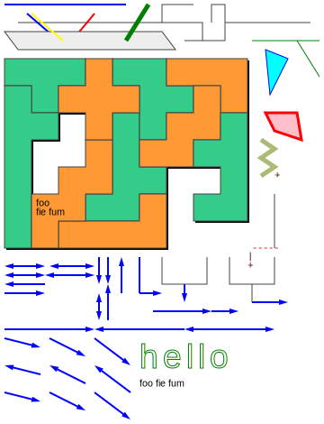
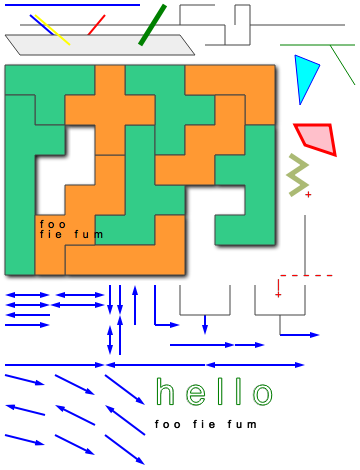

# Ritaa

## Example

test.ritaa:

    +--------------------------+       +------+   +--+
                                       |          |  |
       +-------------------------------+--------+ +  +------------------+
    +----------------------------------+        |    |
                       P1                   +---+----+
       +----------------------------------+
    +-----+-----+-----+-----+-----+-----+-----+-----+-----+
    |grn              |org  |grn        |org              |
    |                 |     |           |                 |
    +-----+     +-----+     +-----+     +-----+-----+     +
    |grn  |     |                 |           |org  |     |
    |     |     |                 |           |     |     |
    +     +-----+-----+     +-----+     +-----+     +-----+
    |           |nil  |     |grn  |     |           |grn  |
    |           |     |     |     |     |           |     |
    +     +-----+     +-----+     +-----+     +-----+     +
    |     |           |org  |     |           |           |
    |     |           |     |     |           |           |
    +     +     +-----+     +     +-----+-----+-----+     +
    |     |     |           |           |           |     |     +
    |     |     |           |           |           |     |
    +     +-----+     +-----+     +-----+     +-----+     +     +
    |     |foo        |           |org  |     |           |     |
    |     |fie fum    |           |     |     |           |     +
    +     +     +-----+-----+-----+     +     +-----+-----+     |
    |     |     |                       |                       +
    |     |     |                       |                       |
    +-----+-----+-----+-----+-----+-----+                  -----+
                         + +  ^   +    +         +    +   |     +
    <--------><--------->| |  |   |    |         |    |   +     |
    <------->+<--------->| v  |   |    |         |    |         |
    <--------+           v +  |   |    +----+----+    +----+----+
    +-------->           ^ ^  +   +---->    |              |
                         | |                v              +------->
                         | |         +----------->+----->
                         v +
    edge {"x1": 0, "y1": 3, "x2": 3, "y2": 5}
    edge {"x1": 35, "y1": 3, "x2": 38, "y2": 5}
    L1 {"x1": 20, "y1": 1, "x2": 15, "y2": 4, "stroke": "red", "z": 5}
    line {"x1": 5, "y1": 1, "x2": 12, "y2": 4, "z": 5}
    line {"x1": 6, "y1": 1, "x2": 13, "y2": 4, "stroke": "yellow", "z": 15}
    L3 {"x1": 32, "y1": 0, "x2": 27, "y2": 4, "stroke": "green", "stroke-width": 5, "z": 15}
    image {"margin": "5pt", "stroke": "#444", "stroke-width": 1}
    lines {"stroke": "blue", "stroke-width": 2}
    polygons {"fill": "#ccc"}
    polylines {"fill": "none"}
    paths {"fill": "none"}
    grn {"fill": "#3c8", "drop-shadow": true}
    org {"fill": "#f93", "drop-shadow": true}
    polygon {"points": "58,5 63,6 59,10", "fill": "cyan", "stroke": "blue"}
    P2 {"points": "58,12 65,12 66,15 60,14", "fill": "pink", "stroke": "red", "stroke-width": 3}
    polyline {"points": "57,19 60,18 57,17 60,16 57,15", "stroke-width": 5, "stroke": "#abba74"}
    path {"d": "M 55,4 L 70,4 M 65,4 L 70,8", "stroke": "green"}
    P1 {"fill": "#eee", "z": 10}
    drop-shadow {"blur": 2, "offset": 2, "fill": "#000"}
    arrow {"width": 10, "height": 6, "color": "blue"}
    line {"x1": 0, "y1": 36, "x2": 20, "y2": 36, "arrow-end": true}
    line {"x1": 20, "y1": 36, "x2": 40, "y2": 36, "arrow-start": true}
    line {"x1": 40, "y1": 36, "x2": 60, "y2": 36, "arrow-start": true, "arrow-end": true}
    line {"x1": 0, "y1": 37, "x2": 8, "y2": 38, "arrow-end": true}
    line {"x1": 10, "y1": 37, "x2": 18, "y2": 39, "arrow-end": true}
    line {"x1": 20, "y1": 37, "x2": 28, "y2": 40, "arrow-end": true}
    line {"x1": 0, "y1": 40, "x2": 8, "y2": 41, "arrow-start": true}
    line {"x1": 10, "y1": 40, "x2": 18, "y2": 42, "arrow-start": true}
    line {"x1": 20, "y1": 40, "x2": 28, "y2": 43, "arrow-start": true}
    line {"x1": 8, "y1": 44, "x2": 0, "y2": 43, "arrow-start": true}
    line {"x1": 18, "y1": 45, "x2": 10, "y2": 43, "arrow-start": true}
    line {"x1": 28, "y1": 46, "x2": 20, "y2": 43, "arrow-start": true}
    text {"x": 30, "y": 39, "text": "hello"}
    text {"x": 30, "y": 42, "text": "foo fie fum"}
    texts {"alignment-baseline": "middle", "font-size": "8pt", "stroke": "none", "fill": "red", "font-family": "Courier", "kerning": 5}
    /\w/ {"font-family": "Arial"}
    "hello" {"fill": "white", "stroke": "green", "font-size": "28pt", "letter-spacing": 5}
    /^f/ {"fill": "black"}

<!-- . -->

    ritaa test.ritaa -svg -png

test.svg:

test.png:

## Installation

Eventually:

    gem install ritaa

## Dependencies

### Ruby

- [Ruby home page](https://www.ruby-lang.org/en/)

### Node.js

Used by _svgexport_

- [Node.js home page](https://nodejs.org/en/)

### svgexport

For conversion from `.svg` to `.png` format.

- [svgexport home page](https://github.com/shakiba/svgexport)
